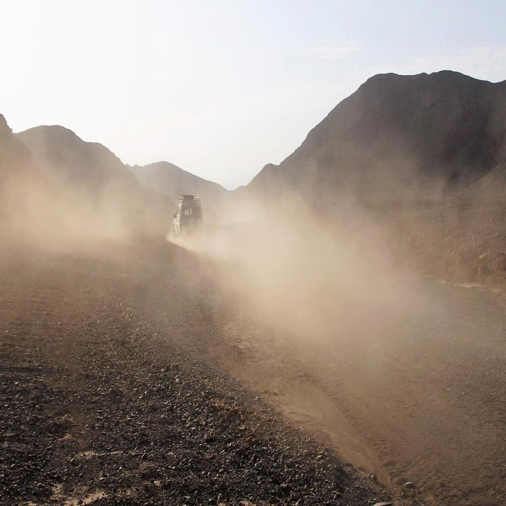
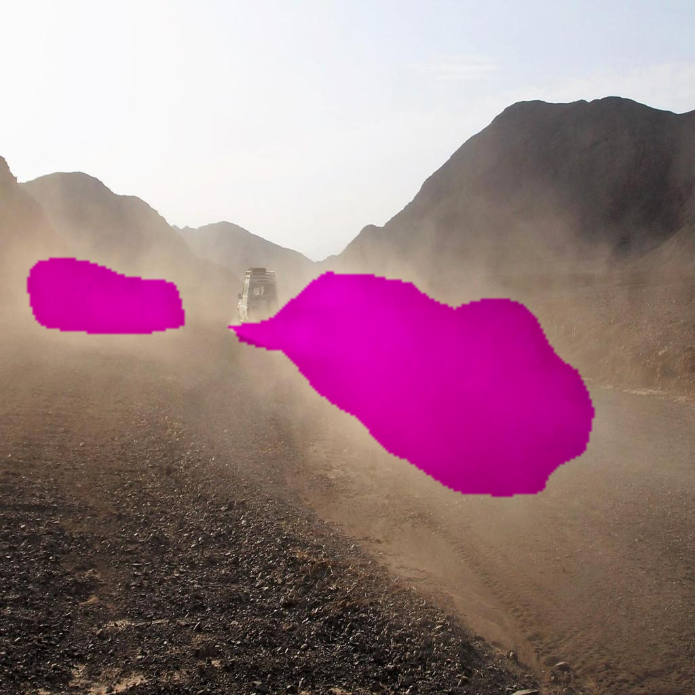
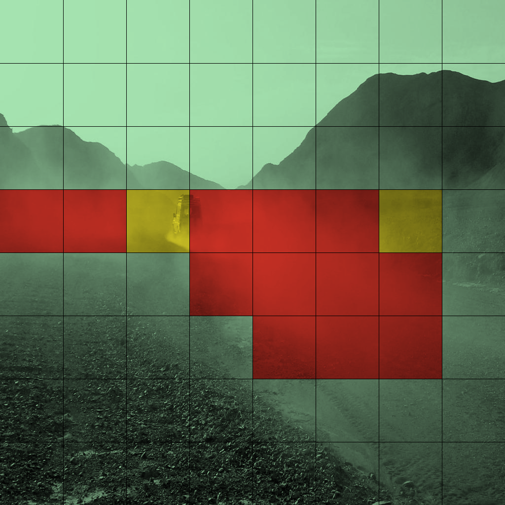

# Descripción
Este programa permite detectar el polvo en una imágen. 
Las imágenes son redimensionadas, tratadas por el modelo para conseguir polvo y añadidas a una cuadrícula de análisis de densidad de polvo.

El programa saca tres resultados:
*   Las imágenes originales redimensionadas
*   Las imágenes con polvo detectado
*   La cuadrícula (cuadro de ajedrez) con el análisis de densidad de polvo 

# Proceso

* Clonar el repositorio.
* Crear un ambiente en conda con el python 3.10.14
* Descargar los archivos de requirements.txt
* Correr el comando: python src/model.py

# Resultados

<h2>Original
 

 
Polvo
 

 
Ajedrez</h2>
 

